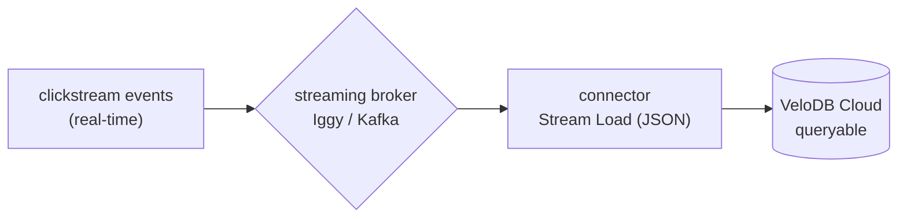
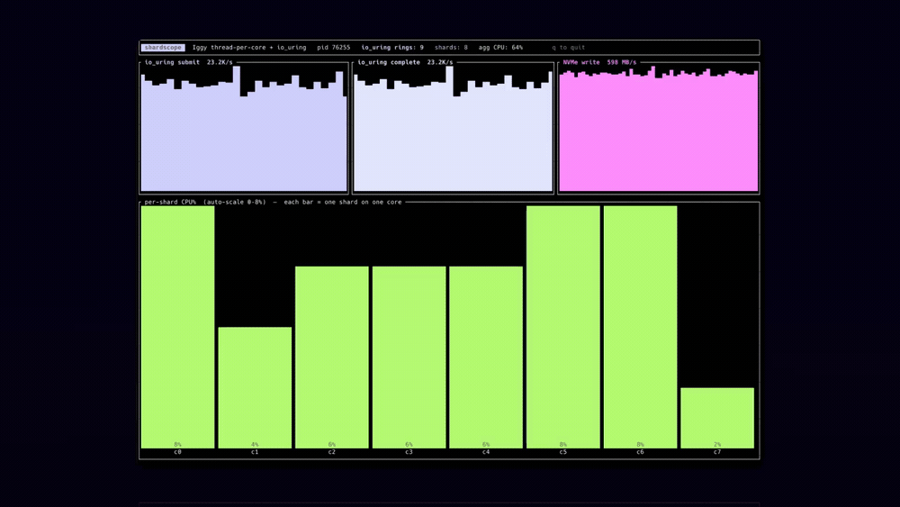
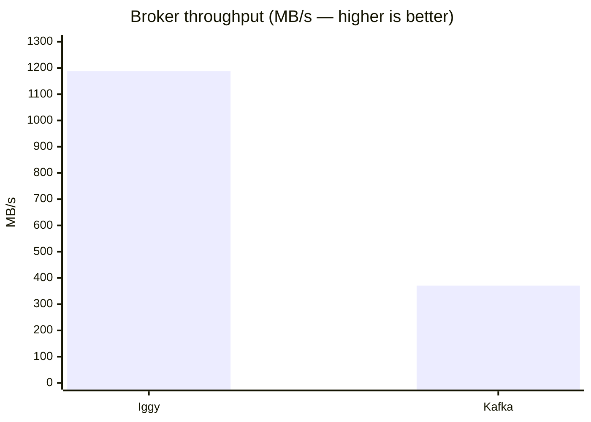
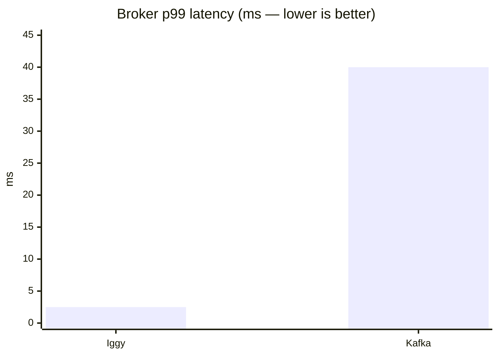
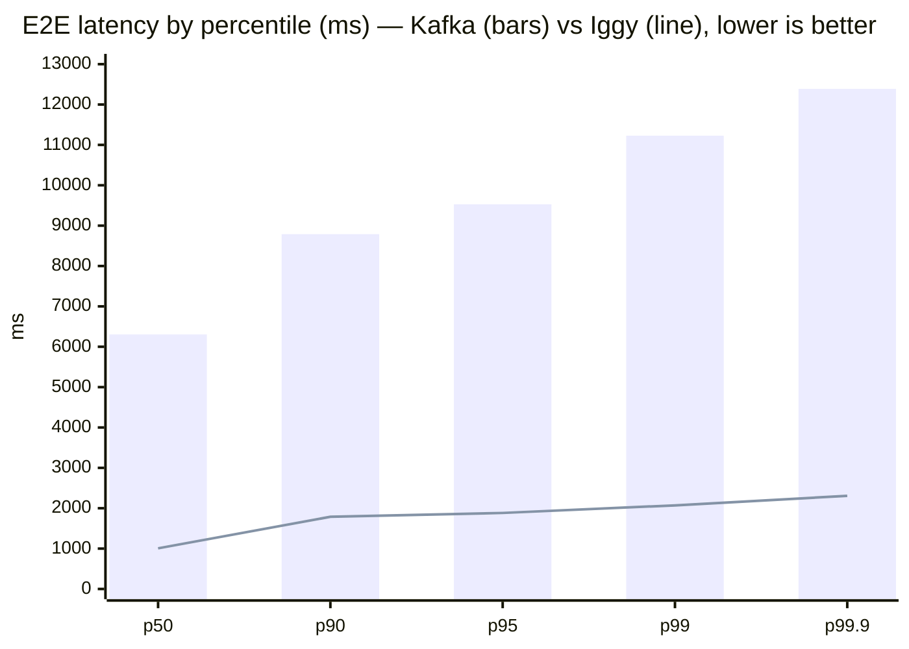

# Real-Time Streaming Ingestion — Iggy & Kafka → VeloDB Cloud

A reproducible benchmark comparing **Apache Iggy** and **Apache Kafka** as the
front-of-pipeline streaming broker for **VeloDB Cloud**, across two layers:
**(1) broker performance** and **(2) end-to-end ingestion latency** for a
real-time clickstream workload.

## Overview

Each broker receives the same clickstream events and feeds the **same** VeloDB
table through its standard connector (HTTP Stream Load). The broker (and its
connector) is the only variable.



## Principles

- **Reproducibility** — fixed hardware, pinned software, disclosed configuration,
  explicit run protocol. Brokers run one at a time on the same machine, back-to-back.
- **Realism** — clickstream JSON with nested objects, ingested through each
  broker's *standard* connector and VeloDB's *default* Stream Load path.
- **Fairness** — identical workload, payload, rate, target table, hardware, and
  region on both sides; each broker uses its own standard tuning.

## Why Iggy is fast — thread-per-core + io_uring

Iggy's performance comes from two mechanisms that directly target tail latency:

- **Thread-per-core, shared-nothing.** Each CPU core runs an independent **shard**
  that exclusively owns a slice of the partitions. There is no shared state and no
  cross-core locking on the hot path — a core never blocks waiting on another.
  This removes the lock contention and context-switching that cap a traditional
  broker's tail latency. (Native Rust, so there are also no JVM GC pauses.)

- **`io_uring` for all I/O.** Instead of a system call per network/disk operation,
  Iggy submits and reaps I/O in **batches through a per-core ring buffer shared
  with the kernel**. Each shard has its own ring. This slashes syscall overhead
  and makes I/O truly asynchronous — the engine keeps cores saturated with useful
  work instead of stalling in the kernel.

The net effect is **low, predictable latency under load** — exactly what the
Layer-2 numbers show.

### The architecture in motion

The capture below shows the running Iggy broker under load: **8 shards, each pinned
1:1 to a CPU core**, **9 `io_uring` rings**, the **live `io_uring` submit/complete
rate**, and **NVMe write throughput** — the thread-per-core + io_uring design doing
the work in real time.



## What the benchmark measures

- **Layer 1 — broker performance.** Each broker in isolation (no database):
  sustained throughput and latency percentiles. Shows the broker's raw capability.
- **Layer 2 — end-to-end latency.** `event → broker → connector → VeloDB Stream
  Load → queryable`, measured server-side in VeloDB (event timestamp vs row ingest
  time), reflecting true time-to-query.

## Hardware

| Role | Instance | vCPU | Memory | Storage | OS / Kernel |
|------|----------|------|--------|---------|-------------|
| Streaming broker | AWS EC2 `c6id.4xlarge` | 16 | 32 GB | local NVMe | Amazon Linux 2023, kernel 6.1 |
| Event source | AWS EC2 `c7i.2xlarge` | 8 | 16 GB | gp3 EBS | Amazon Linux 2023 |
| Analytics backend | **VeloDB Cloud (SaaS)** | **4-core FE (demo)** | managed | managed object store | AWS us-east-1 |

All components run in **AWS us-east-1**, co-located in-region.

## System configuration

| Component | Configuration |
|-----------|---------------|
| **Apache Iggy** | Built from source, release, `RUSTFLAGS="-C target-cpu=native"`, **raw binary (not containerized)**. `io_uring`, thread-per-core (8 shards). TCP transport. |
| **Apache Kafka** | **KRaft mode (no ZooKeeper)**, single process, Java 17. |
| **VeloDB Cloud** | Default **4-core FE**, storage-compute separated, `replication_num = 1`. |
| **Iggy connector** | Native connectors runtime + Doris sink — 2,000-row buffer, 200 ms flush, Stream Load (JSON). |
| **Kafka connector** | Kafka Connect Doris sink — 1,000-record buffer, 1 s flush, Stream Load (JSON). |

### OS & kernel tuning (broker)

Disclosed because Iggy's `io_uring` path has hard OS prerequisites — these are
applied on the broker before any run and verified by a preflight check.

| Setting | Value | Why |
|---------|-------|-----|
| Kernel | **≥ 5.19** (6.1 used) | `io_uring` `COOP_TASKRUN` + `TASKRUN_FLAG` — required by Iggy's shard executors; **no epoll fallback** (server won't start otherwise) |
| `kernel.io_uring_disabled` | **0** (enabled) | `io_uring` must not be restricted (relevant on kernels ≥ 6.6) |
| `RLIMIT_MEMLOCK` | **unlimited** | `io_uring` rings pin locked memory; too low → `ENOMEM` at ring setup |
| `RLIMIT_NOFILE` | **1,048,576** | high file-descriptor / connection count |
| Broker data dir | **local NVMe, XFS** | low-latency, consistent segment writes |
| Deployment | **raw binary, not containerized** | container seccomp profiles block `io_uring` syscalls |
| Instances | **fixed-performance (non-burstable)** | steady CPU, no credit throttling; CPU-frequency scaling left at the AWS default |

### Target table

```sql
CREATE TABLE bench.events (
  partner_id INT NOT NULL, event_type VARCHAR(32) NOT NULL,
  event_timestamp VARCHAR(40) NOT NULL,                  -- event creation time
  user_id BIGINT NOT NULL, event_id VARCHAR(64) NOT NULL,
  session_id VARCHAR(64), page_url VARCHAR(256),
  device_info VARIANT, event_properties VARIANT, utm_params VARIANT,
  ingest_time DATETIME(3) NOT NULL DEFAULT CURRENT_TIMESTAMP(3)  -- queryable time
)
DUPLICATE KEY(partner_id, event_type, event_timestamp, user_id)
DISTRIBUTED BY HASH(user_id) BUCKETS 32
PROPERTIES ("replication_num" = "1");
```

### Workload

- **Layer 1:** 256-byte messages, 1,000 per batch, 8 parallel producers.
- **Layer 2:** clickstream JSON (~400 B, nested `device_info` / `event_properties`
  / `utm_params`) at a sustained **2,000 events/second** — steady-state,
  sub-saturation, so the connector keeps pace and no backlog forms.

## How to run

**Layer 1** (broker only), one broker at a time on the same VM:

```bash
# Iggy — using its bench CLI from the event-source VM:
iggy-bench -m 256 -P 1000 -b 1000 pinned-producer -p 8 -s 8 \
  tcp --server-address <broker>:8090
# Kafka — 8 parallel producers with matched params:
kafka-producer-perf-test.sh --topic bench --num-records 1000000 --record-size 256 \
  --throughput -1 --producer-props bootstrap.servers=<broker>:9092 acks=1 \
  linger.ms=5 batch.size=262144 compression.type=none
```

**Layer 2** (end-to-end into VeloDB):

1. Create the [target table](#target-table); start the broker + its connector
   (latency profile above) pointed at `bench.events` via VeloDB Stream Load
   (`:8080`, user `admin@<cluster>`).
2. Stream clickstream events at 2,000/s for 60 s; each event carries its creation
   timestamp, VeloDB stamps `ingest_time` on load.
3. Confirm steady-state (rows landed == produced), then measure:

```sql
SELECT PERCENTILE_APPROX(lat_ms,0.5)  p50, PERCENTILE_APPROX(lat_ms,0.9)  p90,
       PERCENTILE_APPROX(lat_ms,0.95) p95, PERCENTILE_APPROX(lat_ms,0.99) p99,
       PERCENTILE_APPROX(lat_ms,0.999) p999, MIN(lat_ms) min_ms
FROM (SELECT MILLISECONDS_DIFF(ingest_time,
        CAST(SUBSTRING(REPLACE(event_timestamp,'T',' '),1,23) AS DATETIME(3))) lat_ms
      FROM bench.events) t;
```

## Results

### Layer 1 — Broker performance

| Metric | **Iggy** | **Kafka** |
|--------|----------|-----------|
| Throughput | **1,188 MB/s** | 371 MB/s |
| Messages / s | **4.64 M** | 1.52 M |
| p50 latency | **1.7 ms** | 3 ms |
| p99 latency | **2.5 ms** | ~40 ms |
| p99.9 latency | **12 ms** | ~80 ms |





Iggy sustains **~3× the throughput** at **~16× lower p99 latency**. (Iggy
saturated the instance's network link at 1,188 MB/s — its broker ceiling is
higher; the consistent single-digit-millisecond tail is the architectural result.)

### Layer 2 — End-to-end latency (event → queryable)

| Percentile | **Iggy → VeloDB** | **Kafka → VeloDB** |
|------------|-------------------|--------------------|
| p50 | **1.0 s** | 6.3 s |
| p90 | **1.8 s** | 8.8 s |
| p95 | **1.9 s** | 9.5 s |
| p99 | **2.1 s** | 11.2 s |
| p99.9 | **2.3 s** | 12.4 s |
| min | 36 ms | 55 ms |



The Iggy-based pipeline delivers **~6× lower end-to-end latency** into VeloDB
Cloud, with a tight, predictable tail — the **Iggy line stays near the floor**
while the Kafka bars rise to ~11 s at p99.

## VeloDB scaling (demonstration config)

This benchmark used a **default 4-core VeloDB FE** — a demonstration configuration
for a real-time latency test, **not** tuned for peak throughput. VeloDB scales
**vertically and horizontally**, sustaining **10–30 million rows/second
(60–90 GB/s)** when scaled out. Latency can be reduced further with **Group
Commit** (server-side batching that decouples commit cadence from load frequency).

## Limitations

- **Demonstration-scale backend** — 4-core FE; not representative of VeloDB's
  scaled-out ingest capacity.
- **Single region, single broker node** — `replication_num = 1`; no cross-AZ
  replication in this test.
- **Steady-state** — Layer 2 measured below saturation; overload behavior not
  characterized.

## Conclusion

Apache Iggy's **thread-per-core + io_uring** architecture delivers **~3× broker
throughput and ~16× lower tail latency** than Kafka (Layer 1), and a **~6× lower
end-to-end latency** into VeloDB Cloud (Layer 2) — **~1 s p50, ~2 s p99**
event-to-queryable. Paired with VeloDB scaling to **tens of millions of rows per
second**, the architecture delivers both low-latency, query-ready freshness and
massive throughput on the same platform.
